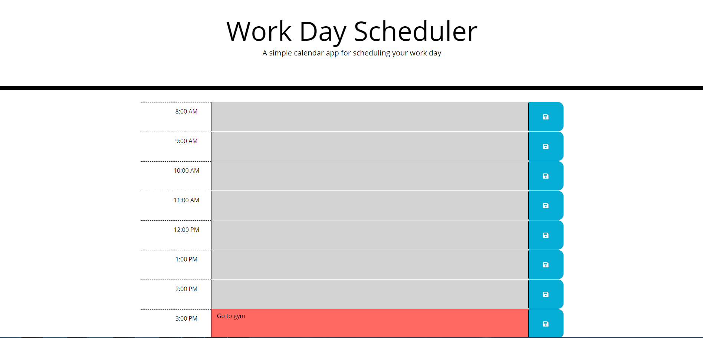

# Week5-hw

The assignment was to create a calendar app for a person to plan and save events for each hour during the day.  Starter code was given for html and css, jquery/javascript code was added to achieve the goal.  All acceptance criteria were met. 

https://github.com/drewml08/Week5-hw

